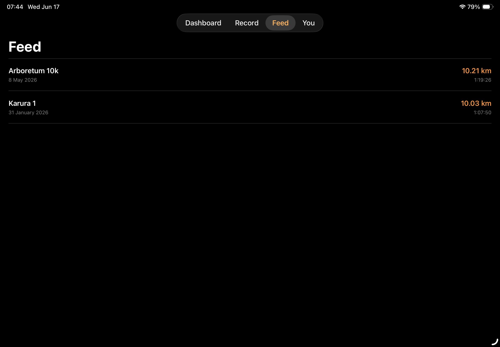
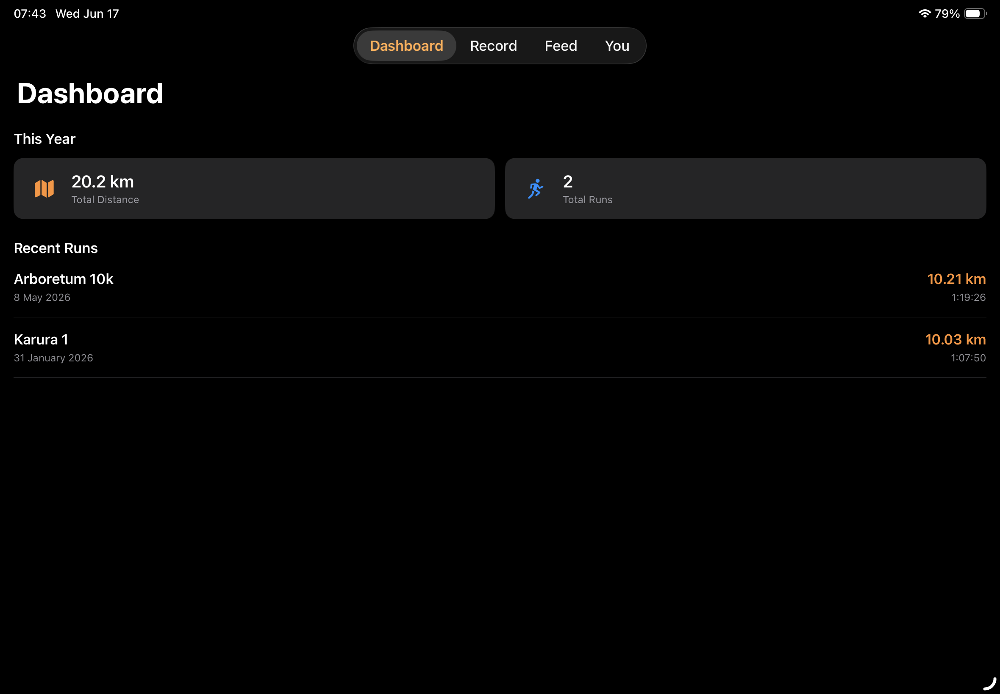
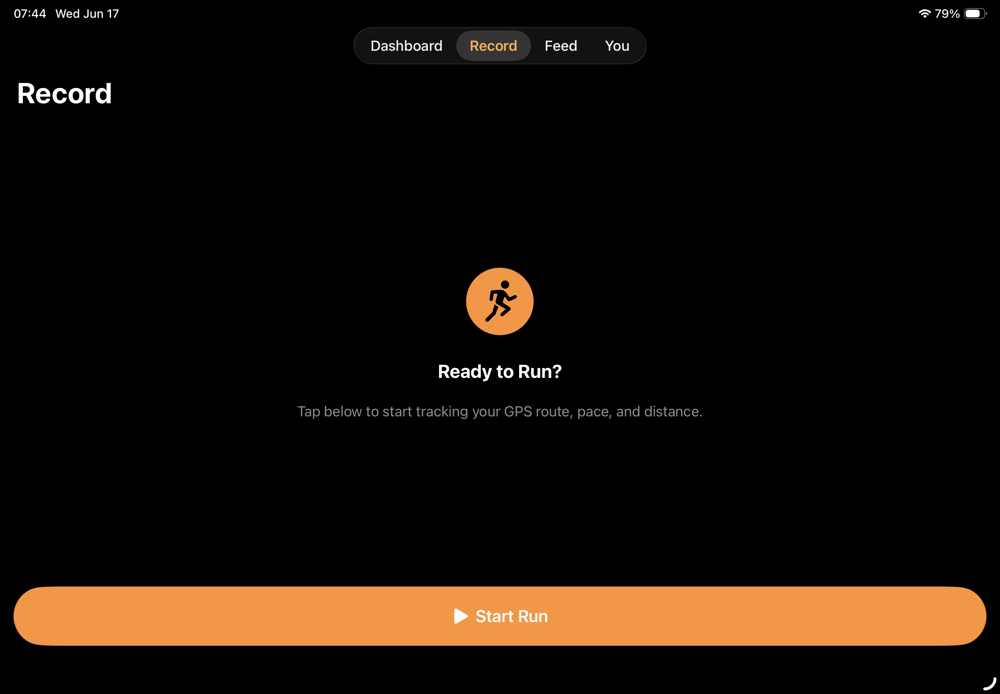
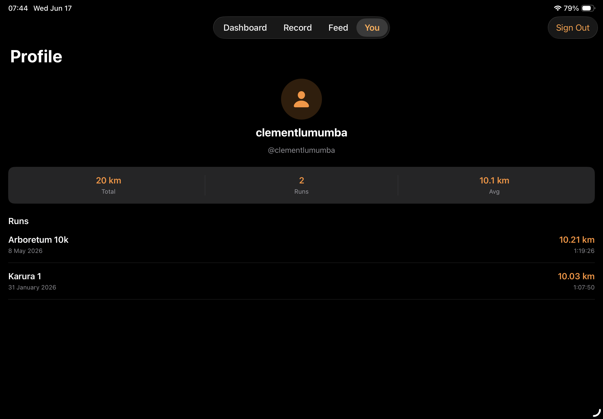
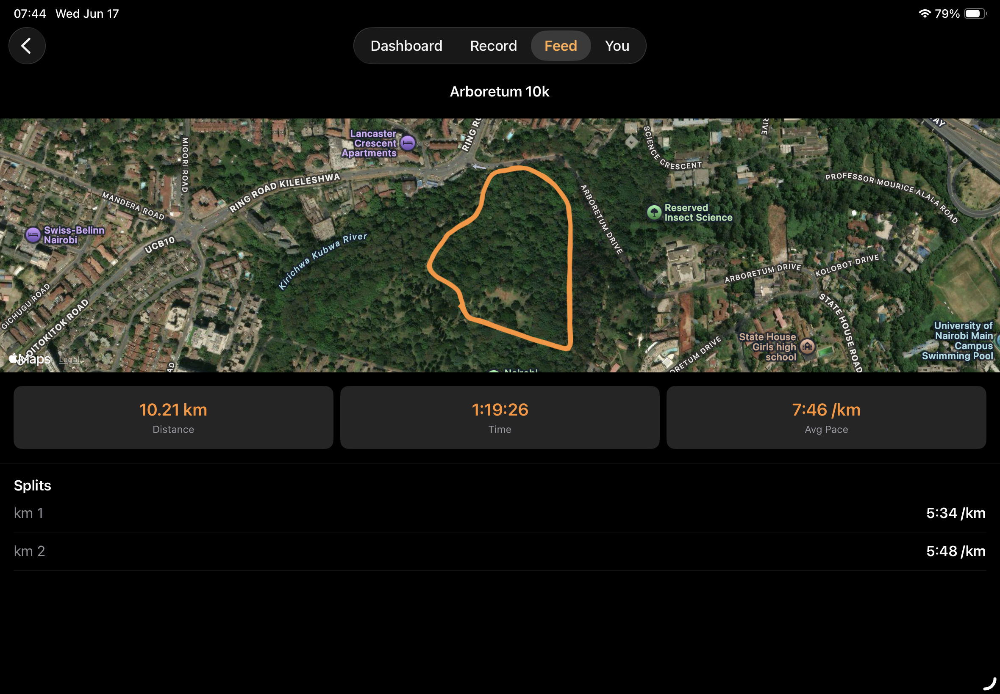
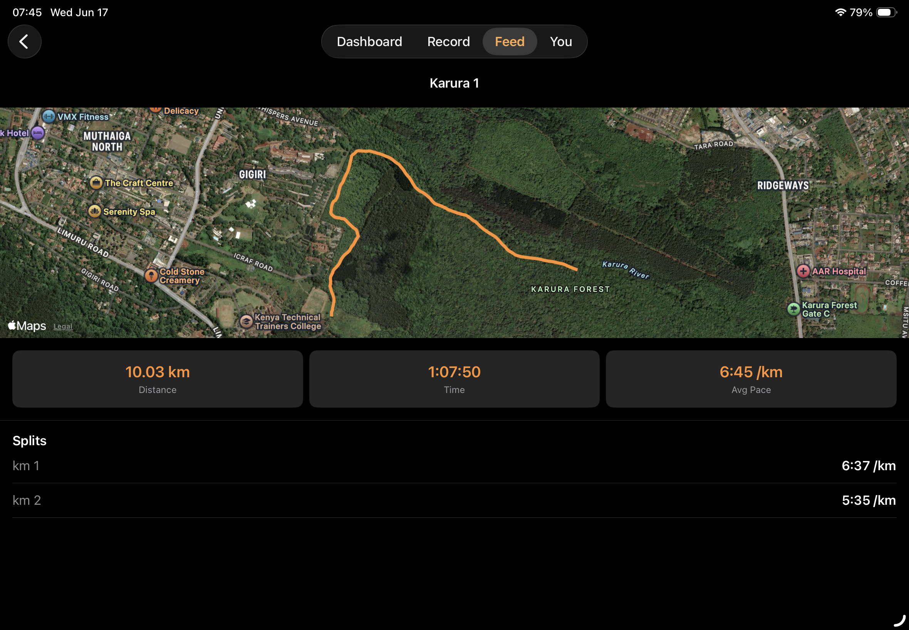

# Speeed

A GPS running tracker for iOS and iPadOS, built with SwiftUI and the Composable Architecture. Track distance, pace, and route. Follow friends, give kudos, and compete on segments.

## Screenshots



Sign in with email/password or Google OAuth via Supabase Auth.



Dashboard with yearly total distance, run count, and recent runs.



Run history list with distance, duration, and pace for each completed run.



Run detail with full stats and a MapKit polyline replay of the route.



Profile screen showing user stats and account management.



Social feed of runs from followed users.

## Stack

| Layer | Technology |
|---|---|
| UI | SwiftUI (iOS 17+) |
| State management | [Composable Architecture (TCA)](https://github.com/pointfreeco/swift-composable-architecture) 1.26 |
| Backend | [Supabase](https://supabase.com) (Postgres + Auth) |
| Location | Core Location |
| Maps | SwiftUI `Map` + `MapPolyline` |
| Project generation | [XcodeGen](https://github.com/yonaskolb/XcodeGen) |

## Features

- Email/password and Google OAuth sign-in via Supabase Auth
- Dashboard with yearly distance and run count stats
- Run history with route replay on MapKit
- Live GPS run recording with pace and distance (in progress)
- Social feed from followed users (in progress)
- Kudos on runs (in progress)
- Segments and leaderboards (planned)

## Project Structure

```
Speeed/
├── App/                    # Root reducer + entry point
├── Configuration/          # Supabase URL + anon key (gitignored)
├── Dependencies/           # TCA dependency registrations
├── Features/
│   ├── Auth/               # Login (Google, email) + Register
│   ├── AppTabs/            # Tab container
│   ├── Dashboard/          # Yearly stats + recent runs
│   ├── Record/             # Pre-run screen
│   ├── ActiveRun/          # Live GPS tracking + save flow
│   ├── RunHistory/         # Run list + detail with map
│   ├── Feed/               # Social feed
│   └── Profile/            # Own profile, stats, sign out
├── Models/                 # Run, RunLocation, Profile, Follow, Kudos
scripts/
└── seed_runs.py            # GPX → Supabase data seeder
supabase/
└── migrations/             # Schema, RLS policies, triggers
project.yml                 # XcodeGen config
```

## Getting Started

### Prerequisites

- Xcode 16+
- [XcodeGen](https://github.com/yonaskolb/XcodeGen): `brew install xcodegen`
- A [Supabase](https://supabase.com) project

### 1. Clone and configure

```bash
git clone https://github.com/Clemo97/speeed.git
cd speeed

# Copy the config template and fill in your values
cp Speeed/Configuration/Configuration.example.swift Speeed/Configuration/Configuration.swift
```

Edit `Speeed/Configuration/Configuration.swift`:

```swift
enum Configuration {
    static let supabaseURL = "https://YOUR_PROJECT_REF.supabase.co"
    static let supabaseAnonKey = "YOUR_SUPABASE_ANON_KEY"
}
```

Values are available from **Supabase Dashboard → Project Settings → API**.

### 2. Apply database migrations

```bash
supabase link --project-ref YOUR_PROJECT_REF
supabase db push
```

This applies 8 tables (profiles, runs, run_locations, follows, kudos, segments, segment_efforts, notifications), RLS policies, and triggers.

### 3. Enable Auth providers

In Supabase Dashboard → Authentication → Providers:
- Enable **Google** (requires a Google Cloud OAuth client ID)
- Make sure **Email/Password** is enabled

### 4. Generate and open the project

```bash
xcodegen generate
open Speeed.xcodeproj
```

Set your Development Team in Xcode (Signing & Capabilities), then build and run on a device (location tracking requires real hardware).

### 5. (Optional) Seed demo data

```bash
python3 scripts/seed_runs.py
```

Parses GPX files from `GPX/` and inserts runs with full GPS track data into Supabase.

## Architecture

The app uses TCA with `@Reducer`, `@ObservableState`, and `@Dependency` throughout. Navigation uses `StackState`/`StackActionOf` for push flows. Data flows directly to Supabase via the REST API — feature reducers call `supabaseClient.from(_:).select().execute()` on appear, and the Supabase Swift SDK handles auth tokens automatically.

```
View → Store.send(action)
          ↓
       Reducer
          ↓ effect
    supabaseClient.from("runs").select().execute()
          ↓
       Supabase Postgres (via REST API)
```

## License

MIT
